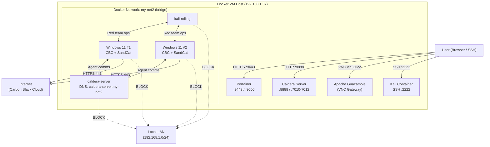

# Carbon Black Cloud - Rapid Demo / Proof of Concept or Proof of Value

- This docker compose file sets up a Carbon Black Cloud demo evnruonment using,  2xWindows 11 with Carbon Black Sensor and Caldera Sensor automatically installed, Apache Gucamole configred to access the Windows conatiners via VNC, a Kali container, Portainer for container visability and Caldera as a container all on the same Docker host.

This enables a rapid, automated, repeatable, and thorough demo to showcase lateral movement and the full capabilities of Carbon Black Cloud.

Includeds;

- 2 x Windows 11 with Carbon Black Sensor installed to your registration key and Caldera SandCat sensor.
- Portainer for container managment
- Caldera Container
- Kali Container (WIP) and Exploit
- Container Firewall rules to block all traffic to local network and only allow access to Carbon Black Cloud IPs

# Network Diagram

